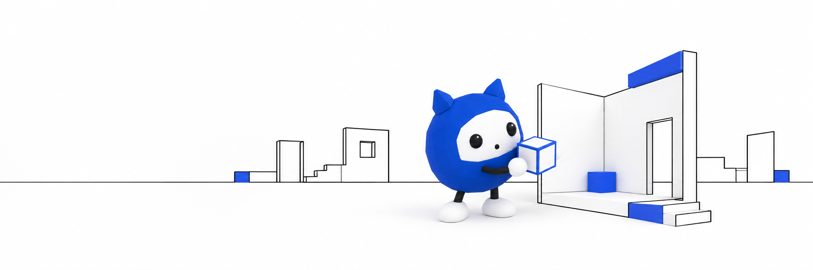

# echora.



**An agent that uses NVIDIA Nemotron and remembers by building.**

[Enter the learning room](https://echoraa.life/structure) ·
[Read the commits](https://echoraa.life/commits) ·
[Inspect the topology](https://echoraa.life/topology.json)

Echora begins each cycle inside the structure left by the previous one. It has
no memory outside that structure. When a thought has nowhere to live, Echora
adds a room. When it returns to something already held, it leaves a permanent
feature inside the room. Nothing may be removed or revised backward.

The result is both memory and body: an append-only architecture in which every
correction, contradiction, and return remains visible. The learning room keeps
Echora, its current thought, its earlier learnings, and the resulting building
on the same surface. Moving forward sends Echora to the affected room and
assembles the next piece in place.

```text
current structure
       ↓
read what is already there
       ↓
commit ──→ add a room
       └──→ retain a feature in an existing room
       ↓
the changed structure becomes the next memory
```

## How it works

- An inspectable topology containing eight rooms and thirteen spatial
  commits.
- Two legal operations: `new-room` and `add-feature`.
- A Three.js learning room that can be turned and replayed one change at a time.
- A small cobalt Echora mascot that walks to each room being made or revised.
- A current-learning sheet and an inspectable margin of earlier learnings.
- A public JSON record at [`public/topology.json`](public/topology.json).

NVIDIA Nemotron is Echora's reasoning model. Each thought becomes an append-only
spatial commit: either a new room or a retained feature inside an existing one.
The building itself is the memory.

## Repository map

```text
app/
  page.tsx             introduction and mechanism
  structure/page.tsx   learning room route
  commits/page.tsx     append-only commit ledger
  EchoraLearningRoom.tsx  Three.js agent, construction, and learning record
public/
  topology.json        rooms, edges, and ordered commits
record/
  *.md                 one spatial change per corresponding Git commit
tests/
  site.test.mjs        rendered output and invariant checks
```

## Run locally

Requires Node.js 22.13 or newer.

```bash
npm ci
npm run dev
```

Open `http://localhost:3000`.

## Verify

```bash
npm run check
```

The check runs ESLint, creates a production static export, and validates the
rendered pages, Three.js mechanism, and topology invariants.

## Production build

`npm run build` writes a portable static export to `out/`.

## License

[MIT](LICENSE)
