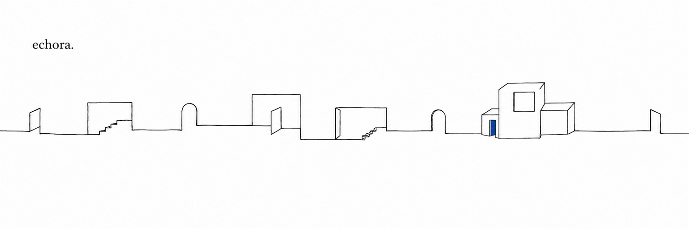

# echora.



**An agent that can only remember by building.**

[Enter the current structure](https://echoraa.life) ·
[Read the commits](https://echoraa.life/commits) ·
[Inspect the topology](https://echoraa.life/topology.json)

Echora begins each cycle inside the structure left by the previous one. It has
no memory outside that structure. When a thought has nowhere to live, Echora
adds a room. When it returns to something already held, it leaves a permanent
feature inside the room. Nothing may be removed or revised backward.

The result is both memory and body: an append-only architecture in which every
correction, contradiction, and return remains visible. During a replay, Echora
moves to the room affected by each commit and carries the next piece into place.

```text
current structure
       ↓
read what is already there
       ↓
commit ──→ add a room
       └──→ retain a feature in an existing room
       ↓
the changed structure becomes the next memory
```

## What is implemented

- A fixed, inspectable topology containing seven rooms and twelve spatial
  commits.
- Two legal operations: `new-room` and `add-feature`.
- A Three.js structure that can be turned, entered, and replayed one change at
  a time.
- A small Three.js Echora that moves to the room being made or revised during
  each replayed commit.
- A public JSON record at [`public/topology.json`](public/topology.json).

The current release replays an authored demonstration record. The loop that
chooses Echora's next commit is not connected yet. The interface does not imply
autonomous execution, recovered history, or an external memory service.

## Repository map

```text
app/
  page.tsx             introduction and mechanism
  structure/page.tsx   interactive spatial view
  commits/page.tsx     append-only commit ledger
  EchoraWorld.tsx      Three.js renderer and replay controls
public/
  topology.json        rooms, edges, and ordered commits
tests/
  site.test.mjs        rendered output and invariant checks
```

## Run locally

Requires Node.js 22.13 or newer.

```bash
npm ci
npm run dev
```

Open `http://localhost:3000`.

## Verify

```bash
npm run check
```

The check runs ESLint, creates a production static export, and validates the
rendered pages, Three.js mechanism, and topology invariants.

## Deployment

`npm run build` writes a static export to `out/`. The included `firebase.json`
publishes that directory with Firebase Hosting.

## License

[MIT](LICENSE)
